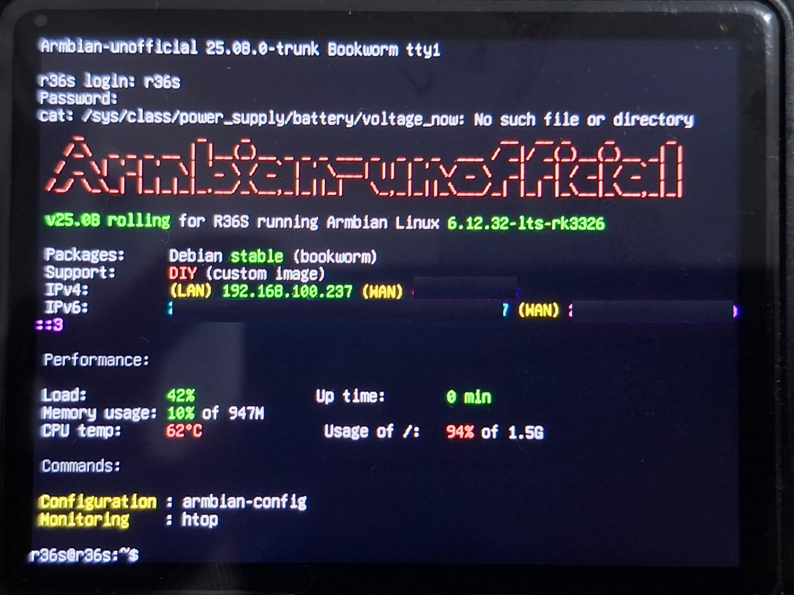
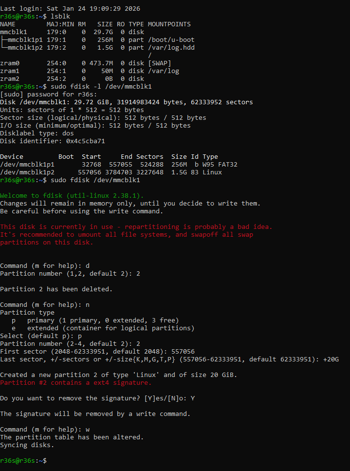

# LuaES
Game engine like Pico 8 but using Love2d to be able to play at hardware that supports opengl es

# Run on Linux armbian on R36s handheld game console

- Download [armbian-r36s-bookworm-minimal.img.xz
](https://github.com/R36S-Stuff/R36S-Armbian/releases/tag/RC5)
- Install image on microsd 


- update firstrun_overrides.txt file on micro sd with your WiFi and password
- firstrun_overrides.txt:
```
rootpass=r36s
FancyUserName=R36S
username=r36s
userpass=r36s
ssid=WiFi
wifipass=asuhdude
```

- insert micro sd in r36s and boot for first configuration
- use wifi dongle R36S (WiFi) RTL8188FTV USB
- turn on r36s
- reboot
- first login: user/password: r36s/r36s
- it should automatically connect to your wifi. if not, redo whole process



- On your PC, run ssh r36s@192.168.100.237
- password: r36s


# Increase size for mmcblk1p2

```
 Load:         2%               Up time:       4 min
 Memory usage: 9% of 947M
 CPU temp:     52°C              Usage of /:   94% of 1.5G

 Commands:

 Configuration : armbian-config
 Monitoring    : htop

Last login: Sat Jan 24 19:09:29 2026
r36s@r36s:~$ lsblk
NAME        MAJ:MIN RM   SIZE RO TYPE MOUNTPOINTS
mmcblk1     179:0    0  29.7G  0 disk
├─mmcblk1p1 179:1    0   256M  0 part /boot/u-boot
└─mmcblk1p2 179:2    0   1.5G  0 part /var/log.hdd
                                      /
zram0       254:0    0 473.7M  0 disk [SWAP]
zram1       254:1    0    50M  0 disk /var/log
zram2       254:2    0     0B  0 disk
```

- sudo fdisk -l /dev/mmcblk1
- **Memorize/store the start value**

```
Device         Boot  Start     End Sectors  Size Id Type
/dev/mmcblk1p1       32768  557055  524288  256M  b W95 FAT32
/dev/mmcblk1p2      557056 3784703 3227648  1.5G 83 Linux
```

- sudo fdisk /dev/mmcblk1



- sudo partprobe /dev/mmcblk1
- sudo resize2fs /dev/mmcblk1p2
- lsblk
- df -h


# install an update

- sudo apt update && sudo apt upgrade -y
- sudo reboot

# Auto login

- sudo systemctl edit getty@tty1

```
[Service]
ExecStart=
ExecStart=-/sbin/agetty --autologin r36s --noclear %I $TERM
```

# Run love2d in r36s

- sudo apt install git -y
- mkdir -p ~/projects
- cd ~/projects
- git clone https://github.com/RobertoFreireDev/R36s-Love2d-GameEngine-Lua
- sudo apt install love -y
- love --version
- cd R36s-Love2d-GameEngine-Lua/src/
- Use framebuffer + GLES on supported hardware
- sudo apt install mesa-utils libgles2-mesa-dev libegl1-mesa-dev -y
- love . (to run)

# TO DO

- Create local multiplayer simples games using lua enet https://love2d.org/wiki/lua-enet
- use sound clone, stop, play and volume to fix abrupt sound when playing multiple times sfx function
- Save/Load Music patterns in txt file
- Implement UI for Sprite/Map Editor
- Implement UI for Sfx/Music Editor

# Run on ArkOS RG353PS 

- alt + l on main.lua to test
- compact all files in same level as file main.lua to zip file and rename to .love extension
- Copy and paste file.love to roms/love2d folder
- to validate files: cmd -> ssh ark@192.168.100.86
- ls -a /opt/love2d (files saved on /opt/love2d)
